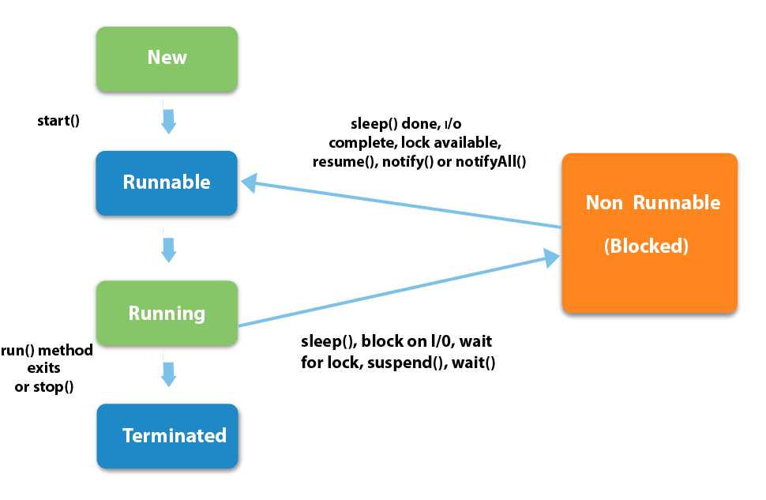

# Deadlock Characterization

## Necessary Conditions

If **four condition all set**, deadlock **can happen**

1. **Mutual Exclusion** At least one resource have to be occupied without sharing
2. **Hold and Wait** Process have to be wait for resource, occupying another resource
3. **No Preemption** Processes cannot preempt resources
4. **Circular Wait** In waiting processes { P0, P1, ... , Pn }, P0 waits for P1 resource P1 waits for P2 resource ... Pn waits for P0 resource

## Resource Allocation Graph

**Rn** : Resource  
**Each dot in Rn** : resource instance  
**Pn** : Process




### Java example for Deadlock

```java
class A implements Runnable {
    private Lock first, second;
    
    public A(Lock first, Lock second) {
        this.first = first;
        this.second = second;
    }
    
    public void run() {
        try {
            first.lock();
            // do something
            second.lock();
            // do something else
        }
        finally {
            first.unlock();
            second.unlock();
        }
    }
}

class B implements Runnable {
    private Lock first, second;
    
    public B(Lock first, Lock second) {
        this.first = first;
        this.second = second;
    }
    
    public void run() {
        try {
            second.lock();
            // do something
            first.lock();
            // do something
        }
        finally {
            second.unlock();
            first.unlock();
        }
    }
}

public class DeadlockExample {
    public static void main(String arg[]) {
        Lock lockX = new ReentrantLock();
        Lock lockY = new ReentrantLock();
        
        Thread threadA = new Thread(new A(lockX, lockY));
        Thread threadB = new Thread(new B(lockX, lockY));
        
        threadA.start();
        threadB.start();
    }
}
```


## References




